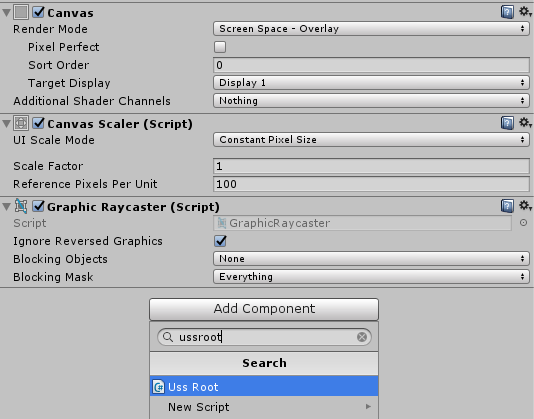

Installation
====

First, you have to import `uss.unitypackage`.

Setup
----
Once you import the package, there will be `UssRoot` in __Canvas__ object.
If there isn't, please add `UssRoot` component to __Canvas__. 
 
 

Create ucss file
----