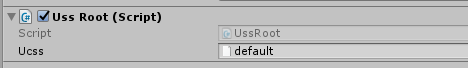

Installation
====

First, you have to import `uss.unitypackage`.

Setup
----
Once you import the package, there will be `UssRoot` in __Canvas__ object.
If there isn't, please add `UssRoot` component to __Canvas__.<br>
<br>
<br>
Next, create a `ucss` file to somewhere proper place. (ex: `Assets/Resources/default.ucss`)<br>

<br>
There's a __Ucss__ slot in `UssRoot`.<br>
Drag the `.ucss` file you just created to the __Ucss__.<br>
<br>
You can specify different files for each scene.


Load ucss with code
----
You can also load __ucss__ in with code. 
```csharp
var ucss = System.IO.File.ReadAllText("PATH_TO_LOAD");

UssStyleModifier.LoadUss(ucss);
```
`LoadUss` can be executed in runtime. But this can hang your application in few moments.