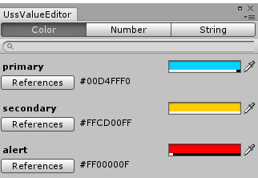

<p align="center">
  
</p>
<p align="center">
__Unity Style Shit__
</p>
<br>

Concept
----
```css
Text {
    color: #FF00FFFF;
    font-size: 20;
}
```

Features
----
* CSS oriented syntax
* Zero overhead (editor-time execution)
* Auto refreshing
* Instant editor

Instant Editor
----

